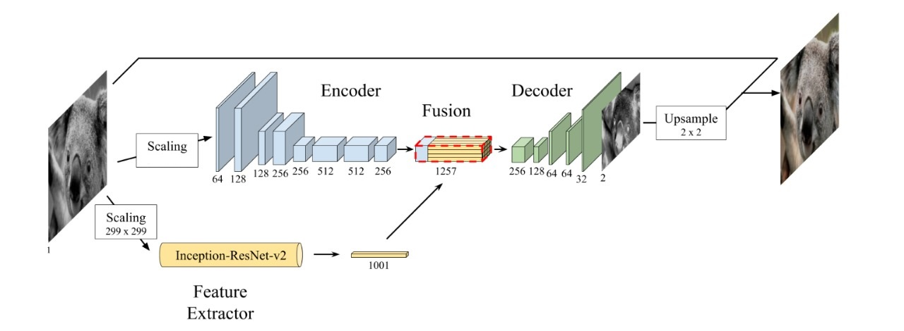

# Colorización de Imágenes 
## Transfer Learnig from Inception Moldel: Imagenet.
#### Integrantes: Erwin Paillacán- Héctor Zúñiga
### Arquitectura
 <br />
### ¿Cómo usar?  
Dejar todas las imagenes que se quieran ocupar para entrenamiento y validacion en la carpeta: ```/train``` y ```/validation```. Las imágenes de prueba dejarlas en la Carpeta```/test```. Luego ejecutar sólo una vez ```data_utils_RESNET.py```, que crea los tfrecord. Luego ejecutar ```train_RESNET.py``` y finalmente ```evaluar_RESNET.py``` que coloriza 100 imagenes de la carpeta test y las guarda en ```/results``` . Recomiendo ejecutar las cosas con Pycharm cerrado y Chrome igual, se liberan 3 Gb de RAM.<br />
### Resultados
 <br />
 <br />


